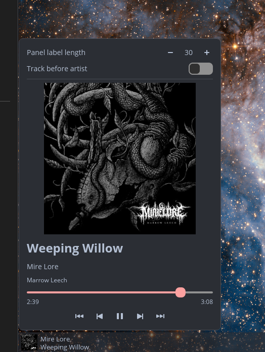

# Now Playing — COSMIC Applet

A now-playing applet for the [COSMIC™ desktop](https://system76.com/cosmic) that
keeps the focus on the album art. It shows the current track inline on the panel
and opens a popup with large cover art, track info, a seek bar, and media
controls — driven by any [MPRIS2](https://specifications.freedesktop.org/mpris-spec/latest/)
player (Plexamp, Spotify, browsers, mpv, etc.).



## Features

- **Inline panel display** — album-art thumbnail plus a two-line title/artist
  label. The label auto-sizes to the panel height and collapses to a single line
  on very thin panels.
- **Large album art popup** — 300×300 cover art with title, artist, and album
  (plus release year when available).
- **Media controls** — previous / play-pause / next, a seek bar, and ±10s skip.
- **Quick panel gestures** — scroll over the applet to change tracks,
  middle-click to play/pause.
- **Stable player selection** — ignores the `playerctld` proxy and prefers the
  actively playing player, so the panel doesn't flicker.

## Settings

Available at the top of the popup:

- **Panel label length** — max characters shown in the panel label.
- **Track before artist** — show the title before the artist (default: artist
  first).

## Building

```sh
just build-release
```

## Installing

```sh
sudo just install
```

This installs the binary, desktop entry, metainfo, and icon. To uninstall:

```sh
sudo just uninstall
```

After updating, restart the running instance so the panel picks up the new
binary:

```sh
pkill -f cosmic-applet-now-playing
```

## License

Licensed under the [GNU General Public License v3.0](LICENSE).
